# 🎲 Symbaroum Companion

🇬🇧 *[English version](README.en.md)*

> **Application mobile complète de gestion de campagnes pour le JDR [Symbaroum](https://freeleaguepublishing.com/games/symbaroum/)** — Feuilles de personnage interactives, synchronisation temps réel Firebase, et outils pour Maîtres du Jeu et Joueurs.

[](https://flutter.dev/)
[](https://dart.dev/)
[](https://firebase.google.com/)
[]()
[]()
[](LICENSE)

---

## ⚠️ Avertissement & Propriété Intellectuelle

> **Symbaroum** est un jeu de rôle créé par **Free League Publishing**. Cette application est un projet **fan-made non officiel**, développé à des fins personnelles et éducatives. Aucune donnée propriétaire du jeu (textes de règles, illustrations, bestiaire, etc.) n'est incluse dans ce dépôt.
>
> L'application est actuellement en **test fermé sur le Google Play Store** dans le respect du RGPD. Une prise de contact avec l'éditeur est prévue pour discuter de la suite du projet.

---

## 📱 Aperçu

<p align="center">
  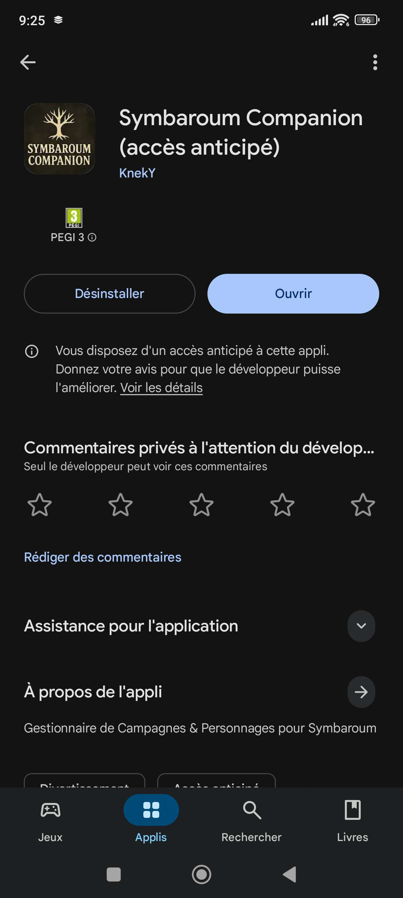
  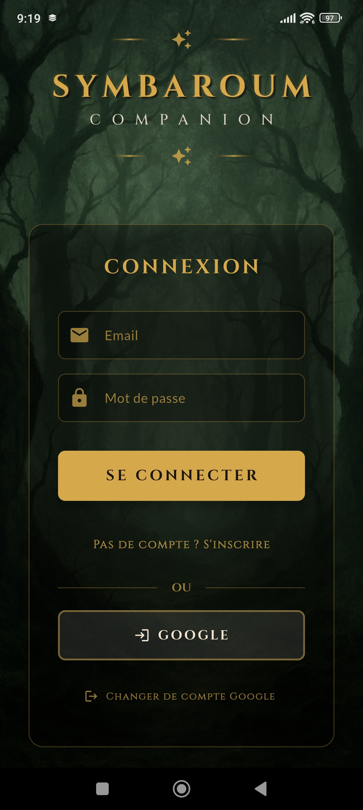
  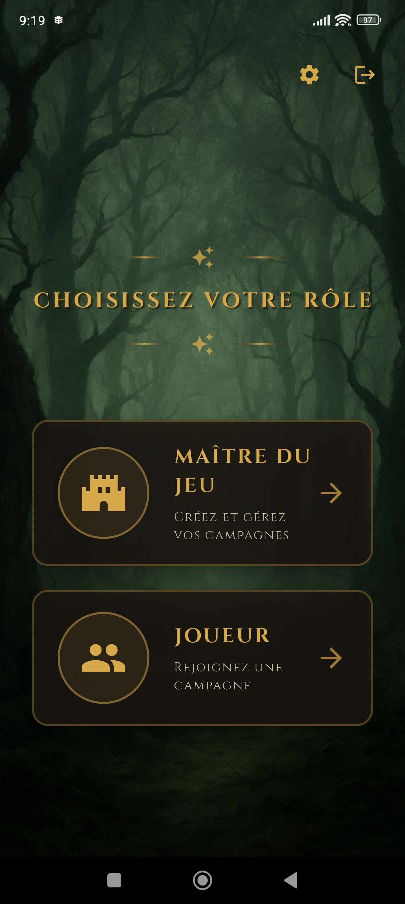
</p>

### 🎩 Vue Maître du Jeu

<p align="center">
  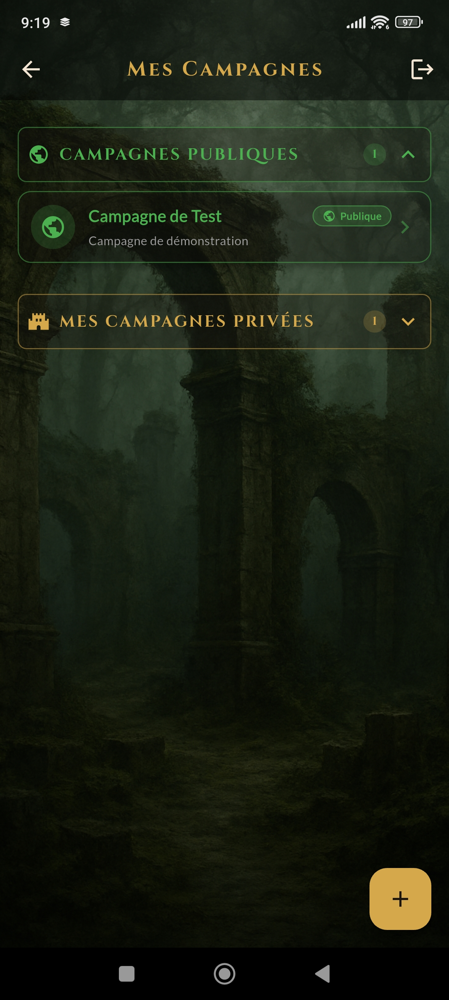
  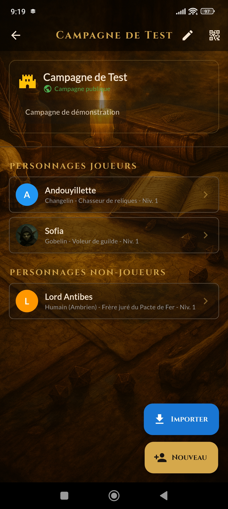
  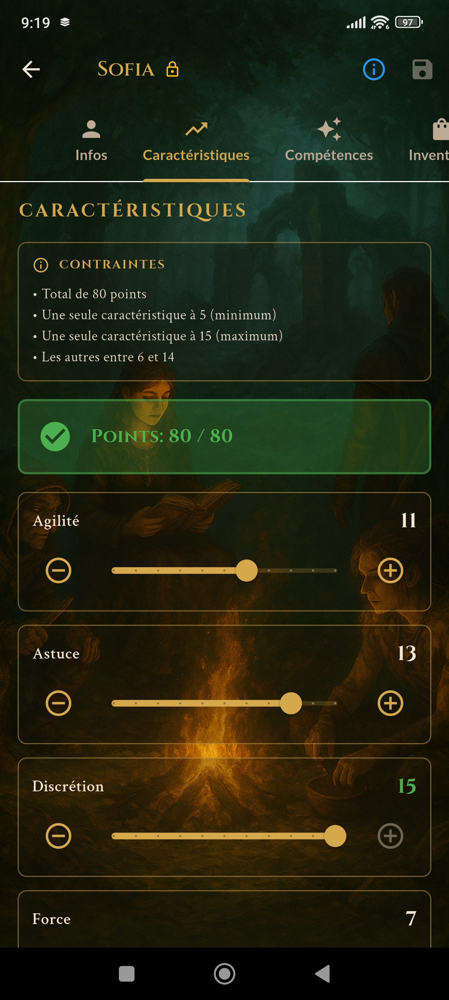
  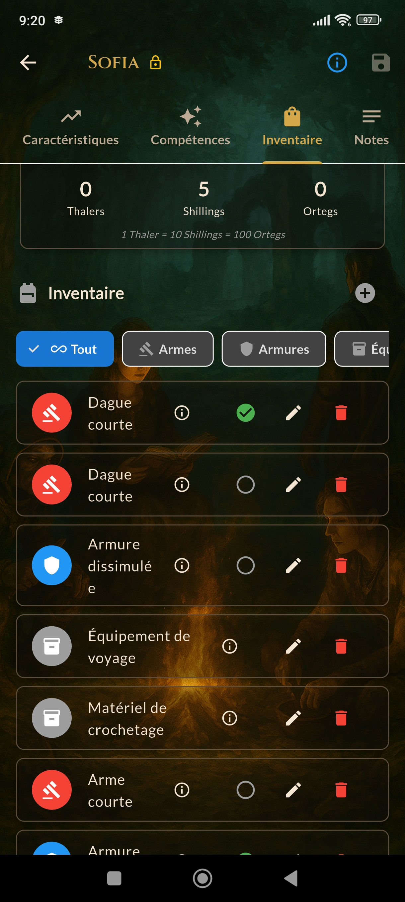
  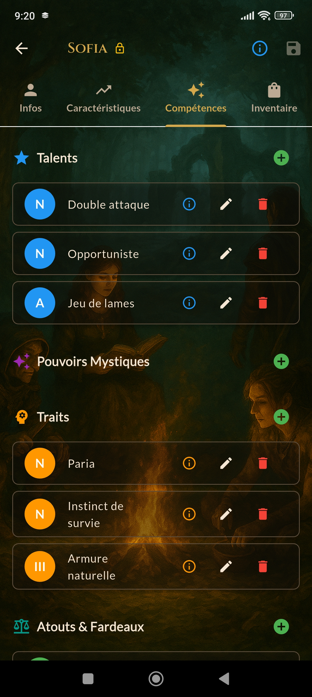
</p>

### 🗡️ Vue Joueur

<p align="center">
  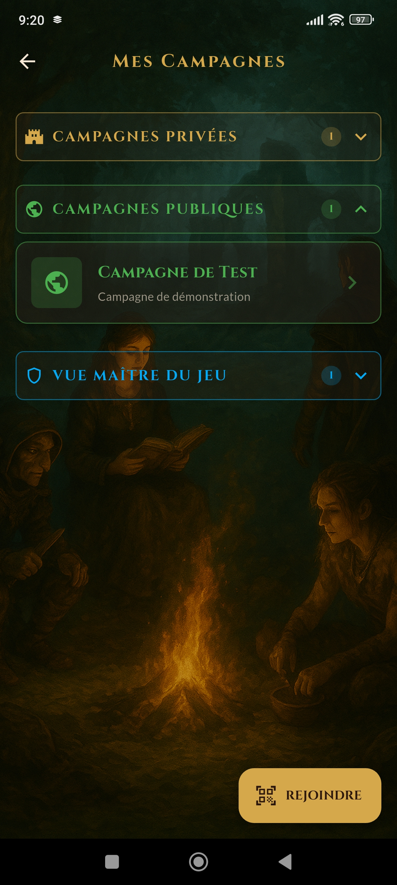
  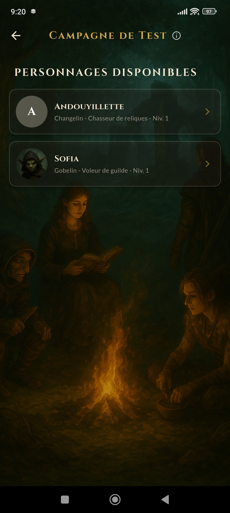
  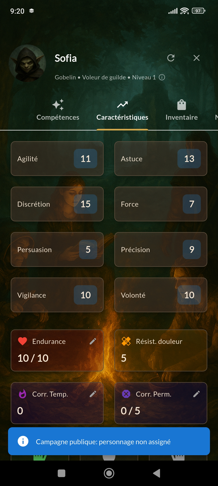
  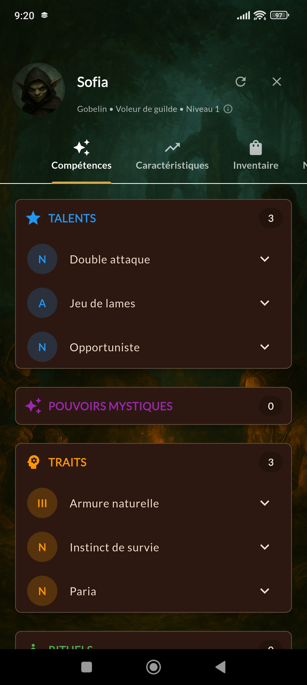
</p>

---

## 🎯 Le Projet en Bref

**Symbaroum Companion** est une application mobile qui permet aux tables de jeu de rôle Symbaroum de gérer numériquement et collaborativement leurs campagnes, remplaçant les feuilles de personnage papier par une interface interactive et synchronisée en temps réel.

### Deux Rôles

| 🎩 Maître du Jeu (MJ) | 🗡️ Joueur (PJ) |
|---|---|
| Crée et gère les campagnes | Rejoint via scan QR code |
| Génère des QR codes d'invitation | Fiche de personnage interactive |
| Modifie tous les personnages en temps réel | Synchronisation automatique |
| Inflige dégâts, soigne, attribue XP | Gestion d'inventaire |
| Supervise tous les personnages | Consultation talents & pouvoirs |

---

## 🏗️ Architecture Technique

### Stack Technologique

```
┌──────────────────────────────────────────────────────────────┐
│                     SYMBAROUM COMPANION                      │
│                 Architecture Full Firebase                   │
└──────────────────────────────────────────────────────────────┘

┌───────────────────────┐          ┌───────────────────────────┐
│   FLUTTER APP (Client)│          │   FIREBASE (Backend)      │
│   ────────────────────│          │   ──────────────────────  │
│                       │          │                           │
│  • Riverpod (State)   │◄────────►│  • Firestore (NoSQL DB)   │
│  • Freezed (Models)   │  Realtime│  • Firebase Auth          │
│  • Material Design 3  │  Streams │  • Firebase Storage       │
│  • Responsive UI      │          │  • Cloud Functions        │
│  • QR Code Scanner    │          │  • App Check (Security)   │
│                       │          │                           │
└───────────────────────┘          └───────────────────────────┘
         │
         ▼
┌───────────────────────┐
│   Platforms           │
│   ─────────────       │
│  • Android (Play Store│
│    test fermé)        │
│  • Web (techniquement │
│    prêt, non déployé) │
└───────────────────────┘
```

### Organisation du Code Flutter

```
flutter_app/lib/
├── config/                    # Configuration Firebase & App
│   ├── app_config.dart        # URLs, constantes, logging
│   ├── firebase_config.dart   # 🔒 Clés Firebase (non inclus - voir .example)
│   ├── firebase_initialization.dart
│   ├── routes.dart            # Navigation nommée
│   └── theme.dart             # Thème Material 3 personnalisé
│
├── models/                    # Modèles de données (Freezed + JSON)
│   ├── personnage.dart        # Personnage complet
│   ├── campagne.dart          # Campagne et ses joueurs
│   ├── talent.dart            # Talents (novice/adepte/maître)
│   ├── pouvoir.dart           # Pouvoirs mystiques
│   ├── equipment.dart         # Armes, armures, équipement
│   ├── inventaire.dart        # Système d'inventaire
│   ├── caracteristiques.dart  # Les 8 caractéristiques Symbaroum
│   ├── trait.dart             # Traits de personnage
│   ├── argent.dart            # Système monétaire (Thaler/Shilling/Orteg)
│   └── game_data.dart         # Données de référence du jeu
│
├── providers/                 # State Management (Riverpod)
│   ├── firebase_providers.dart # Providers Firestore streams temps réel
│   └── providers.dart          # Providers applicatifs
│
├── services/                  # Couche d'accès aux données
│   ├── firestore_service.dart      # CRUD Firestore générique
│   ├── firestore_adapter.dart      # Adapter pattern pour Firestore
│   ├── firebase_auth_service.dart  # Authentification (Google, Email)
│   ├── firebase_storage_service.dart # Upload avatars
│   ├── storage_service.dart        # Stockage local sécurisé
│   ├── notification_service.dart   # Notifications in-app
│   └── permission_service.dart     # Gestion des rôles MJ/PJ
│
├── screens/                   # Écrans de l'application
│   ├── firebase_login_screen.dart         # Connexion (Google / Email)
│   ├── role_selection_screen.dart          # Choix du rôle MJ ou PJ
│   ├── welcome_screen.dart                # Accueil
│   │
│   ├── # --- Flux MJ ---
│   ├── campagnes_list_screen.dart         # Liste des campagnes
│   ├── create_campagne_screen.dart        # Création de campagne
│   ├── campagne_detail_screen.dart        # Détail campagne + joueurs
│   ├── campagne_manage_screen.dart        # Gestion avancée
│   ├── qr_code_display_screen.dart        # QR code d'invitation
│   ├── personnage_detail_screen.dart      # Fiche personnage (vue MJ)
│   │
│   ├── # --- Flux Joueur ---
│   ├── player_campagnes_screen.dart       # Mes campagnes (joueur)
│   ├── player_personnage_select_screen.dart # Sélection personnage
│   ├── player_character_main_screen.dart  # Hub principal joueur
│   ├── player_character_detail_screen.dart # Ma fiche de personnage
│   ├── player_character_creation_screen.dart # Création de personnage
│   ├── qr_code_scan_screen.dart           # Scanner QR d'invitation
│   └── account_settings_screen.dart       # Paramètres du compte
│
├── widgets/                   # Composants réutilisables
│   ├── combat_stats_widget.dart           # Stats de combat calculées
│   ├── capacite_selection_dialog.dart     # Sélection talents/pouvoirs
│   ├── description_dialog.dart            # Affichage descriptions riches
│   ├── responsive_wrapper.dart            # Responsive design
│   └── background_setter.dart             # Fond thématique Symbaroum
│
└── utils/                     # Utilitaires
    ├── combat_stats_calculator.dart       # Calculs défense/protection/attaque
    ├── character_validator.dart            # Validation des personnages
    └── avatar_utils.dart                  # Gestion des avatars
```

### Sécurité Firebase

- **Firebase App Check** — Protection contre les abus (reCAPTCHA v3 / Play Integrity)
- **Firestore Security Rules** — Accès contrôlé par rôle (MJ/PJ) et ownership
- **Firebase Auth** — Google Sign-In + Email/Password
- **Cloud Functions** — Opérations sensibles côté serveur (suppression de compte)
- **Storage Rules** — Upload avatars restreint aux utilisateurs authentifiés

---

## 🚀 Fonctionnalités

### ✅ Implémentées

- [x] **Authentification** — Google Sign-In + Email/Password via Firebase Auth
- [x] **Gestion des campagnes** — Création, édition, invitation par QR code
- [x] **Fiches de personnage complètes** — Les 8 caractéristiques, PV, corruption, XP
- [x] **Talents** — Système novice/adepte/maître avec descriptions
- [x] **Pouvoirs mystiques & Rituels** — Traditions, niveaux, descriptions
- [x] **Traits de personnage** — Atouts, fardeaux, traits raciaux
- [x] **Inventaire** — Gestion des objets portés/rangés
- [x] **Armes & Armures** — Avec qualités spéciales et calculs automatiques
- [x] **Gestion de l'équipement porté** — Les éléments équipés impactent dynamiquement les stats de défense et de protection
- [x] **Calculs automatiques** — Défense, protection, attaque, seuil de corruption (recalculés en temps réel selon l'équipement)
- [x] **Synchronisation temps réel** — Firestore streams pour MAJ instantanées
- [x] **Système de rôles** — MJ (contrôle total) vs PJ (sa fiche uniquement)
- [x] **Actions MJ** — Dégâts, soins, attribution d'XP en un clic
- [x] **Avatars** — Upload et recadrage avec Firebase Storage
- [x] **Responsive** — Adapté mobile et tablette
- [x] **Thème Symbaroum** — UI sombre et atmosphérique

### 🔄 En cours

- [ ] Interface joueur enrichie (onglets dédiés)
- [ ] Combat : gestion des rounds et initiatives
- [ ] Journal de campagne partagé

### 📋 Roadmap

- [ ] **Chat temps réel MJ-Joueurs** — *TODO : évaluer la techno (Firestore subcollections ? Firebase Realtime DB ? Solution tierce ?) pour un chat responsive sans casser l'architecture existante*
- [ ] **Bonus / malus conditionnels avancés** — *TODO : certains bonus dépendent de combinaisons complexes (talent + niveau + équipement porté). Problème de modélisation en BDD : les mettre en dur n'est pas propre, les rendre dynamiques est un vrai défi d'architecture*
- [ ] Marketplace : achat/vente d'équipement
- [ ] Générateur de PNJ / créatures
- [ ] Export/Import de personnages (PDF / JSON)
- [ ] **Internationalisation (i18n)** — *L'application est actuellement entièrement en français. Une portabilité vers l'anglais est envisagée*
- [ ] Mode hors-ligne avec sync différée
- [ ] Notifications push

---

## 💡 Parcours du Projet

Ce projet a connu une **évolution architecturale significative** :

### v1 — Python + Kivy + Flask + SQLite
Architecture initiale avec client desktop Kivy, serveur Flask REST + Socket.IO, et base SQLite. Fonctionnel mais limité en termes de déploiement mobile et de temps réel.

### v2 — Flutter + Firebase (architecture actuelle)
Migration complète vers Flutter pour le multi-plateforme et Firebase pour le backend serverless. Gain majeur en temps réel (Firestore streams), authentification (Firebase Auth), et déployabilité (Play Store + Web).

> Le code dans ce repo reflète l'architecture **v2 (Flutter + Firebase)**.

---

## 🛠️ Stack Technique

| Catégorie | Technologies |
|---|---|
| **Frontend** | Flutter 3.x, Dart 3.10, Material Design 3 |
| **State Management** | Riverpod 3 + Riverpod Generator |
| **Models** | Freezed + JSON Serializable |
| **Backend** | Firebase (Firestore, Auth, Storage, Functions, App Check) |
| **Auth** | Google Sign-In, Email/Password |
| **CI/CD** | Google Play Console (Android) |
| **QR Codes** | qr_flutter (génération) + mobile_scanner (scan) |
| **Media** | image_picker + image_cropper |
| **Ancienne stack (v1)** | Python, Flask, Socket.IO, SQLAlchemy, SQLite, Kivy |

---

## 📦 Structure du Dépôt

```
symbaroum-companion-showcase/
├── flutter_app/           # 📱 Application Flutter (code source principal)
│   ├── lib/               # Code Dart
│   ├── android/           # Configuration Android
│   ├── assets/            # Images et ressources visuelles
│   └── pubspec.yaml       # Dépendances Flutter
│
├── functions/             # ☁️ Firebase Cloud Functions (Node.js)
│   └── index.js           # Suppression sécurisée de compte
│
├── screenshots/           # 📸 Captures d'écran de l'application
│
├── firebase.json          # Configuration Firebase
└── storage.rules          # Règles de sécurité Storage
```

> **Note :** Les fichiers de configuration Firebase (clés API, `google-services.json`) ne sont pas inclus dans ce dépôt pour des raisons de sécurité. Des fichiers `.example` sont fournis pour faciliter la mise en place. Les données de jeu propriétaires (textes de règles, bestiaire, etc.) appartenant à Free League Publishing ne sont pas incluses.

---

## 🔧 Installation (pour les développeurs)

### Prérequis

- [Flutter SDK](https://flutter.dev/docs/get-started/install) 3.x+
- [Firebase CLI](https://firebase.google.com/docs/cli)
- Un projet Firebase configuré
- Android Studio ou VS Code

### Étapes

1. **Cloner le repo**
   ```bash
   git clone https://github.com/MatJoss/symbaroum-companion-showcase.git
   cd symbaroum-companion-showcase
   ```

2. **Configurer Firebase**
   ```bash
   # Copier les fichiers de configuration exemple
   cp flutter_app/lib/config/firebase_config.dart.example flutter_app/lib/config/firebase_config.dart
   cp flutter_app/android/app/google-services.json.example flutter_app/android/app/google-services.json
   ```
   Puis remplacer les valeurs `YOUR_*` par vos vraies clés Firebase dans les fichiers copiés.

3. **Installer les dépendances**
   ```bash
   cd flutter_app
   flutter pub get
   ```

4. **Générer le code (Freezed, Riverpod, JSON)**
   ```bash
   dart run build_runner build --delete-conflicting-outputs
   ```

5. **Lancer l'application**
   ```bash
   flutter run
   ```

---

## 🔍 Aspects techniques notables

- Application Flutter/Dart déployée sur Android (Play Store, test fermé), avec capacité Web
- State management via Riverpod, modèles générés avec Freezed + JSON Serializable
- Backend full Firebase : Firestore (temps réel), Auth (Google + Email), Storage, Cloud Functions, App Check
- Système de rôles MJ/PJ avec règles de sécurité Firestore par ownership
- Modélisation de données imbriquées (personnage → inventaire → équipement → qualités)
- Calculs dynamiques des stats de combat selon l'équipement porté
- Migration complète depuis une v1 Python/Kivy/Flask/SQLite

---

## 📜 Licence

Le code source de ce projet est sous licence [MIT](LICENSE).

> **Important :** Cette licence couvre uniquement le code source de l'application. Le jeu de rôle Symbaroum, ses règles, illustrations et univers sont la propriété de **Free League Publishing AB**. Ce projet n'est pas affilié à Free League Publishing.

---

## 📬 Contact

**MatJoss** — [GitHub](https://github.com/MatJoss)

*Projet fan-made développé avec passion pour la communauté Symbaroum* 🎲🌲
